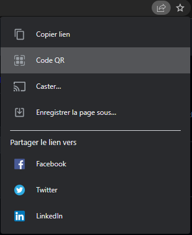
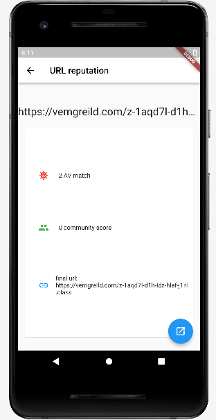

<h1 align="center">QR code reputation</h1>

     
    Analyze QR code via VirusTotal API.

## Features

- Bring your own API key (BYOAK)
- "Minimalist" UI
- Quick access to the VirusTotal report page 

## Getting Started

You will first need to register your VirusTotal API key inside the app.  
> Need an API key ? Get one for free by registering in VirusTotal. Head over [here](https://www.virustotal.com/gui/my-apikey).

1. Scan your VirusTotal API key the first time you launch the app.
   (you can use chrome to generate a QR code, just go to a website then click in the address bar: )
2. Scan a suspect QR code  
     
3. If VirusTotal already seen its URL, the result will appear immediately. If not the app will request a scan and display its result in about a minute.  
     
4. The bottom left button allows to be redirected straight to VirusTotal report website.